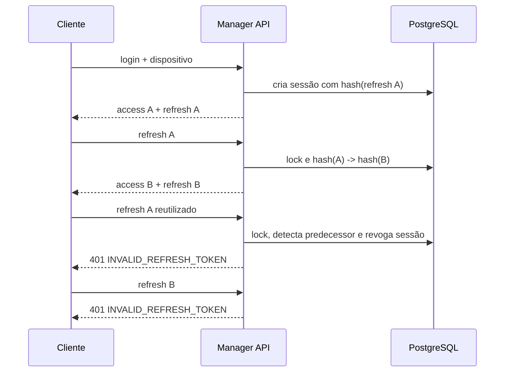

# Autenticação local

## Estado atual

O `PROT-022` entregou o núcleo reutilizável de autenticação por e-mail e senha:
normalização da chave de busca, verificação Argon2id, elegibilidade da conta,
atualização concorrente de `last_login_at` e eventos de sucesso ou falha sem
PII. O `PROT-023` o compôs em `POST /api/v1/auth/login`, sob rate limit
distribuído, e passou a emitir um JWT de acesso curto. O `PROT-024` integrou a
criação de `auth_sessions`, o refresh token rotacionável e
`POST /api/v1/auth/refresh`. Criação/troca de senha, logout, gestão de sessões e
middleware Bearer continuam pendentes.

O rate limit é obrigatório no contrato HTTP final. Ele não pertence ao caso de
uso porque o núcleo também será reutilizado fora do transporte HTTP e não deve
depender de IP, Redis ou Fastify.

`LoginWithEmailAndPassword` chama esse núcleo e, somente depois de uma
credencial válida, cria um identificador UUID v7, emite os dois tokens e
persiste uma linha de `auth_sessions` antes de responder. A linha recebe apenas
o hash do refresh e metadata sanitizada; se a conta perder elegibilidade antes
do insert, nenhum token é entregue. Conta com `mfaEnabled` não recebe token
antes de existir o challenge do `PROT-028`: o fluxo falha fechado com a mesma
resposta `INVALID_CREDENTIALS`.

## Fluxo de autenticação

`AuthenticateWithEmailAndPassword` executa sempre esta sequência:

1. aplica `trim + lowercase` ao e-mail, usando a mesma normalização de
   `accounts.email_normalized`;
2. consulta somente uma conta não excluída e projeta apenas `id`, hash, estado e
   indicador de MFA;
3. executa exatamente uma verificação de senha. Conta ausente, e-mail inválido,
   identidade externa sem senha local e senha acima do limite usam um hash
   Argon2id fictício e público para preservar o trabalho caro;
4. aceita somente hash compatível, senha correta e conta com estado `active`;
5. atualiza `last_login_at` por escrita condicional ao mesmo UUID, hash, estado
   ativo e ausência de soft delete;
6. emite um evento estruturado sem identificadores e devolve somente
   `accountId` e `mfaEnabled`.

Se senha ou hash mudar, a conta for bloqueada/desabilitada ou ocorrer soft
delete entre a leitura e a escrita, a atualização afeta zero linhas e a
tentativa falha. `GREATEST` impede regressão temporal entre logins concorrentes;
cada escrita confirmada incrementa `version`.

## Contrato não enumerável

Conta inexistente, e-mail malformado, senha incorreta, hash ausente ou inválido,
conta `blocked`, conta `disabled`, soft delete e conflito concorrente produzem o
mesmo `InvalidCredentialsError`:

```json
{
  "statusCode": 401,
  "code": "INVALID_CREDENTIALS",
  "messageKey": "authentication.invalidCredentials"
}
```

O handler HTTP traduz a mensagem pelo mecanismo global e inclui somente os
campos públicos já aprovados para erros. Motivo interno, estado da
conta, hash, e-mail e senha nunca fazem parte da exceção, da resposta ou do
evento. A equivalência de resposta e a presença de trabalho Argon2id reduzem
enumeração; não oferecem garantia de tempo constante contra variação de host,
pool, banco ou scheduler. O rate limit do endpoint continua uma defesa
obrigatória em profundidade.

## Access token

O access token é assinado e validado por `jose` `6.2.10`. O contrato atual usa
HMAC SHA-256 (`HS256`) dentro da única fronteira Manager API, com chave de ao
menos 32 bytes carregada exclusivamente de `JWT_ACCESS_SECRET`. O header exige
`typ: at+jwt`; nenhum algoritmo alternativo é aceito.

| Claim       | Valor ou finalidade                                     |
| ----------- | ------------------------------------------------------- |
| `sub`       | UUID v7 da conta                                        |
| `sid`       | UUID v7 da sessão persistida                            |
| `iat`       | instante de emissão em Unix time                        |
| `exp`       | `iat + 900` segundos                                    |
| `iss`       | `urn:protege-mais:authentication`                       |
| `aud`       | `urn:protege-mais:manager-api`                          |
| `token_use` | `access`, impedindo confusão com outras credenciais JWT |

O verificador fixa algoritmo, tipo, issuer, audience, finalidade e tolerância
de relógio zero. Rejeita token vazio ou excessivo, expirado, emitido no futuro,
alterado, assinado com outra chave, com UUIDs inválidos ou validade diferente
de 15 minutos. Toda rejeição usa `INVALID_ACCESS_TOKEN`; a validação será
conectada a rotas protegidas somente pelo `PROT-029`.

O payload não carrega e-mail, telefone, nome, IP, segredo, papel, permissão,
organização ou unidade. Autorização contextual deve consultar o estado vigente,
sem congelá-lo durante os 15 minutos do token. A conferência da sessão no uso do
access token permanece para o middleware do `PROT-029`.

## Refresh token e sessão

O refresh token também é JWT HS256, mas usa exclusivamente
`JWT_REFRESH_SECRET`, `typ: rt+jwt`, audience
`urn:protege-mais:manager-api:token-refresh` e `token_use: refresh`. A chave é
distinta da chave de access. O payload contém somente `sub`, `sid`, `jti`
aleatório de 256 bits, `iat`, `exp`, issuer, audience e finalidade.

A validade inicial é de 30 dias. Ela é absoluta: toda rotação conserva o mesmo
`exp`, portanto atividade contínua não cria uma sessão indefinida. A resposta
de login ou refresh é:

```json
{
  "accessToken": "<segredo omitido>",
  "refreshToken": "<segredo omitido>",
  "tokenType": "Bearer",
  "expiresIn": 900,
  "refreshExpiresIn": 2592000
}
```

Os marcadores acima são apenas documentação e nunca exemplos OpenAPI. Login e
refresh respondem `Cache-Control: no-store` e `Pragma: no-cache`. O valor real
do refresh recebe SHA-256; somente `sha256:<digest-base64url>` é persistido. O
token puro existe na memória necessária à requisição e na resposta TLS sem
cache, sem entrar em banco, Redis, erro ou log.

O login exige `deviceIdentifier` técnico opaco, aceita `deviceName` opcional e
captura o User-Agent observado. Nome e User-Agent são sanitizados e limitados;
o identificador não é fingerprint de hardware. `ip_hash` permanece nulo porque
algoritmo, chave, finalidade e retenção ainda não foram aprovados.

## Rotação e comprometimento

`POST /api/v1/auth/refresh` valida criptograficamente o token antes de tocar o
banco. A rotação abre uma transação, bloqueia a sessão e sua conta elegível,
compara o hash corrente e atualiza hash, `last_used_at`, `updated_at` e `version`
no mesmo commit. O novo refresh e o access token conservam `sid`; o refresh
anterior deixa de ser válido imediatamente.

O `sid`, a conta e a expiração assinados mantêm a relação com a sessão mesmo
depois que o hash muda. Se um token anterior com assinatura válida reaparecer,
a aplicação não tenta escolher qual participante é legítimo: revoga toda a
sessão e emite o evento `authentication.refresh.reuse_detected`. Em duas
requisições simultâneas com o mesmo token, no máximo uma troca vence; a segunda
revoga a sessão, invalidando também o sucessor entregue pela primeira.

Token malformado, alterado, expirado, assinado com outra chave, sessão ausente,
revogada ou vinculada a conta inelegível e reuso compartilham 401
`INVALID_REFRESH_TOKEN`. Nenhum motivo ou ID é exposto. A política e suas
alternativas estão no
[`ADR-011`](../decisions/ADR-011-refresh-token-rotation-and-reuse.md).



## Rate limit do login

Antes de verificar a credencial, a rota consome um contador Redis por endereço
de cliente: cinco tentativas em janela fixa de 60 segundos. O endereço é
transformado por HMAC-SHA-256 com separação de domínio; somente o digest opaco
entra na chave `rate-limit:authentication:login:<digest>`. O namespace do
ambiente é aplicado pelo plugin Redis.

`INCR`, criação condicional do TTL e leitura do TTL acontecem na mesma transação
Redis. A sexta tentativa retorna 429 com `Retry-After`; indisponibilidade ou
resposta incoerente do contador retorna 503 e não chama o caso de uso. O limite
não recebe e-mail ou senha, não registra endereço bruto e não substitui proteções
de borda. A API ainda não confia automaticamente em headers de proxy; uma
topologia reversa deve configurar essa fronteira explicitamente antes do
deploy.

## Política aprovada de senha

Para criação e troca futuras, a aplicação deve:

- normalizar em Unicode NFC antes do hash;
- exigir de 15 a 128 pontos de código;
- aceitar espaços e caracteres Unicode, sem regra de composição por classe;
- rejeitar valor formado somente por espaços e caracteres de controle C0/C1;
- verificar o valor completo, sem `trim`, conversão de caixa ou truncamento;
- comparar novas senhas com uma blocklist de valores comuns ou comprometidos no
  fluxo que as definir.

O helper `isValidNewAuthenticationPassword` cobre a regra sintática. A
blocklist exige fonte, atualização e tratamento operacional próprios e deverá
ser integrada pelos tickets de criação/recuperação; sua ausência não pode ser
interpretada como autorização para persistir senha nova hoje.

No login, o comprimento mínimo não é usado como atalho: uma entrada curta ainda
passa pela verificação cara. Apenas o máximo limita trabalho e memória antes de
substituir a entrada por uma senha fictícia de tamanho controlado.

## Hash e evolução

O serviço usa `argon2` `0.45.1` com Argon2id versão 19, salt aleatório da
biblioteca com 16 bytes, saída de 32 bytes e estes custos:

| Parâmetro     | Valor      |
| ------------- | ---------- |
| memória       | 19.456 KiB |
| iterações     | 2          |
| paralelismo   | 1          |
| comprimento   | 32 bytes   |
| versão Argon2 | 19         |

O formato PHC codifica algoritmo, versão, custos, salt e resultado. Não existe
pepper neste incremento: adotá-lo exige segredo gerenciado, rotação e plano de
recuperação que ainda não foram aprovados. `needsRehash` detecta hash legado,
malformado ou com parâmetros diferentes, mas o login atual não reescreve a
credencial. Uma futura migração oportunista deve ser atômica e não pode tornar
a autenticação dependente de uma segunda escrita.

O build nativo de `argon2` está explicitamente permitido em
`pnpm-workspace.yaml`; novas dependências com scripts continuam bloqueadas até
revisão deliberada.

## Composição e auditoria

As fronteiras vivem em `@protege-mais/interfaces`; o adaptador Drizzle, os
serviços Argon2id/JWT e os casos de uso recebem dependências explicitamente por
construtor. A Manager API cria um container filho por instância Fastify e
registra `DatabaseRw`, contador Redis, logger seguro, relógio, gerador UUID v7 e
os serviços, sem estado global mutável compartilhado entre testes.

Os eventos atuais são:

- `authentication.succeeded`, em nível `info`;
- `authentication.failed`, em nível `warn`;
- `authentication.refresh.succeeded`, em nível `info`;
- `authentication.refresh.failed`, em nível `warn`;
- `authentication.refresh.reuse_detected`, em nível `warn`.

O contrato de auditoria não aceita argumentos, impedindo e-mail, ID da conta ou
motivo da falha por construção. O logger da requisição poderá acrescentar
`requestId` e `correlationId`; payload, credencial e identificadores pessoais
continuam proibidos. Estes eventos operacionais não substituem a trilha durável
de auditoria prevista em tickets posteriores.

## Fronteiras dos próximos tickets

- `PROT-025`: logout idempotente da sessão atual;
- `PROT-026`: listagem e revogação individual/global de sessões;
- `PROT-027`: recuperação e troca de senha, incluindo blocklist;
- `PROT-028`: desafio e confirmação do segundo fator quando `mfaEnabled` for
  verdadeiro.

A autenticação de credenciais não concede papel, permissão, membership ou
contexto organizacional. Autorização permanece uma decisão separada.

---

Documentação Protege Mais — Autenticação local
