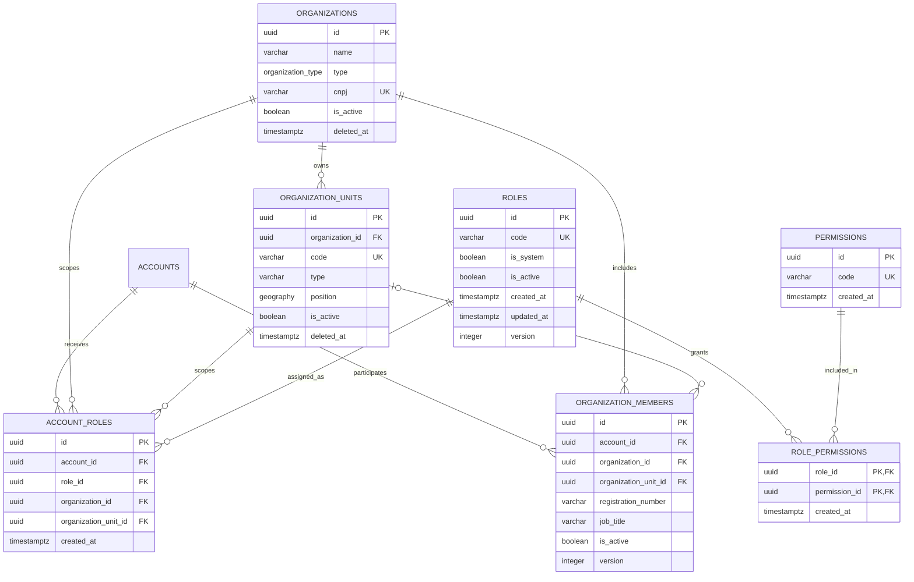

# RBAC, permissões e escopos

## Estado atual

O `PROT-017` materializou a fundação relacional de RBAC. O `PROT-018` acrescenta
um catálogo TypeScript de 19 permissões e um seed aditivo exclusivo de
desenvolvimento. O `PROT-019` materializou `organizations` e protegeu o escopo
organizacional com FK restritiva. O `PROT-020` materializou
`organization_units` e protege o escopo de unidade por uma FK composta com a
organização. O `PROT-021` materializou `organization_members`, com vínculos
organizacionais ou de unidade independentes de papel. Nenhum papel ou
atribuição é criado. As
migrations de produção continuam estruturais e deixam os catálogos vazios; os
tickets `PROT-030` a `PROT-032` implementarão a autorização funcional e a
validação dos vínculos contextuais.

Nenhuma rota, repository ou middleware deve consultar essas tabelas antes de a
cadeia completa de autorização estar implementada. Em particular, código de
papel não substitui verificação de permissão e verificações fixas como
`role === 'ADMIN'` continuam proibidas.

## Catálogo inicial

O código da permissão é o contrato estável entre documentação, backend e banco.
Ele não é texto de interface e nunca deve ser traduzido.

| Recurso        | Ações comuns                                                                           | Ações específicas             |
| -------------- | -------------------------------------------------------------------------------------- | ----------------------------- |
| `account`      | `account.list`, `account.view`, `account.create`, `account.update`                     | `account.disable`             |
| `organization` | `organization.list`, `organization.view`, `organization.create`, `organization.update` | —                             |
| `victim`       | `victim.list`, `victim.view`, `victim.create`, `victim.update`                         | —                             |
| `case`         | `case.list`, `case.view`, `case.create`, `case.update`                                 | `case.close`, `case.transfer` |

As ações comuns representam, respectivamente, enumerar uma coleção autorizada,
consultar um registro, criar um registro e alterar um registro. `disable`
representa desativação de conta, `close` encerramento de caso e `transfer`
transferência de caso. Os tickets consumidores ainda devem definir escopo,
pré-condições, efeitos e auditoria de cada operação; possuir o código no
catálogo não disponibiliza a ação.

`packages/common/permissions` é a fonte tipada, imutável e pública. Ele exporta
`permissionCatalog`, a tuple plana `permissionCodes`, os tipos
`PermissionResource`/`PermissionCode` e o type guard `isPermissionCode`.

## Seed de desenvolvimento

`atlas/seed/dev/20260827012543_initial_permission_catalog.sql` insere somente as
19 permissões, com UUIDs v7 fictícios e explícitos. O conflito é arbitrado pela
constraint única de `code` com `ON CONFLICT (code) DO NOTHING`:

- reaplicar o seed não duplica nem altera linhas;
- uma permissão local com o mesmo código é preservada;
- permissões adicionais, papéis, concessões e atribuições locais não são
  removidos nem modificados;
- `code`, e não o UUID do seed, é o identificador funcional estável;
- colisão do UUID fixo com outro código é erro de integridade e não é ocultada.

Para aplicar estrutura e catálogo localmente:

```bash
pnpm seed:local
```

O comando aplica primeiro `atlas/prod` e depois `atlas/seed/dev`. Uma segunda
execução deve informar que não há arquivos pendentes. `pnpm migrate:local`
continua aplicando somente a estrutura e deve funcionar em uma base vazia sem o
seed.

## Processo de expansão

1. Um ticket consumidor aprova o recurso, a ação, a semântica e o escopo.
2. O código é adicionado ao grupo correto de `permissionCatalog` e, por
   consequência, a `permissionCodes`.
3. Uma nova migration aditiva é criada em `atlas/seed/dev` com UUID v7 fixo e
   `ON CONFLICT (code) DO NOTHING`.
4. Testes comparam exatamente catálogo e migrations, aplicam o seed novamente e
   verificam preservação de dados locais.
5. Documentação e matriz de autorização são atualizadas no mesmo ticket.

Seeds já compartilhados não são reescritos. Renomear ou retirar permissão exige
plano explícito de depreciação e migração de concessões; o seed nunca apaga
`role_permissions` ou `account_roles`. Catálogo de produção, papéis iniciais e
suas matrizes exigem definição própria e não são inferidos deste seed.

## Diagrama relacional



As relações com organização e unidade foram adicionadas em migrations forward
pelos `PROT-019` e `PROT-020`; memberships foram adicionados pelo `PROT-021`,
sem reescrever o histórico compartilhado.

## Dicionário e invariantes

### `roles`

- `code` é um identificador técnico único, em minúsculas, iniciado por letra e
  seguido apenas por letras, números ou `_`;
- `is_system` identifica papéis estruturais protegidos e `is_active` controla se
  suas permissões podem participar de uma decisão;
- um papel de sistema não pode ser inativo;
- `version` implementa concorrência otimista nas mutações suportadas;
- a aplicação gera `id` UUID v7 e fornece explicitamente as flags; o banco não
  infere identidade nem política de negócio.

### `permissions`

- `code` é único e segue exatamente `<recurso>.<ação>`, com um único ponto;
- recurso e ação têm entre 1 e 63 caracteres e aceitam apenas minúsculas,
  números, `_` e `-`;
- exemplos válidos: `victim.view` e `emergency_alert.resolve`;
- o catálogo é imutável pela aplicação: sua evolução ocorre pelo fluxo
  versionado de catálogo definido no `PROT-018`.

### `role_permissions`

- a chave primária composta `(role_id, permission_id)` impede concessões
  duplicadas;
- ambas as referências usam `ON DELETE RESTRICT`;
- relações são imutáveis: alterações são inclusões ou remoções explícitas, não
  atualizações da chave.

### `account_roles`

- cada linha atribui um papel a uma conta em exatamente um contexto;
- referências a conta, papel, organização e unidade usam `ON DELETE RESTRICT`;
- atribuições são imutáveis e não recebem soft delete; a retirada do acesso
  remove a associação explicitamente;
- a unicidade usa `NULLS NOT DISTINCT` sobre conta, papel, organização e
  unidade. Assim, duas atribuições globais idênticas também são duplicidade.

### `organization_members`

- cada linha vincula uma conta a uma organização e, opcionalmente, a uma
  unidade da mesma organização;
- membership não possui `role_id`; pertencimento e papel são invariantes
  independentes;
- `UNIQUE NULLS NOT DISTINCT` rejeita duplicidade em contexto organizacional
  ou de unidade, inclusive quando a unidade é nula;
- `is_active` controla a vigência local; inatividade preserva a linha e não
  libera o mesmo contexto para uma segunda linha;
- matrícula e cargo são opcionais, normalizados e protegidos contra log; a
  matrícula fica fora da projeção padrão;
- FKs restritivas impedem conta/organização inexistente, unidade alheia e hard
  delete dos pais referenciados.

## Semântica de escopo

| Contexto     | `organization_id` | `organization_unit_id` | Válido |
| ------------ | ----------------- | ---------------------- | ------ |
| Global       | `NULL`            | `NULL`                 | sim    |
| Organização  | UUID              | `NULL`                 | sim    |
| Unidade      | UUID              | UUID                   | sim    |
| Unidade órfã | `NULL`            | UUID                   | não    |

Ao avaliar uma unidade, a consulta considera atribuições globais, da
organização solicitada e da própria unidade. Ao avaliar somente uma
organização, considera atribuições globais e dessa organização. A consulta deve
sempre filtrar papéis inativos e retornar permissões distintas.

`organization_id` referencia uma organização existente com exclusão restrita.
Quando `organization_unit_id` existe, a FK composta referencia exatamente
`organization_units (organization_id, id)`: UUID inexistente ou unidade de
outra organização falha. Com unidade `NULL`, `MATCH SIMPLE` preserva o contexto
organizacional. Isso garante integridade, mas não concede acesso: organização
ou unidade inativa/excluída não cria contexto operacional. O runtime só poderá
autorizar acesso após validar atividade da conta e dos pais, membership ativo
no contexto, papel e permissão. Um membership não cria `account_roles`, e uma
atribuição de papel não comprova membership.

## Proteção de papéis de sistema

Mutações suportadas de papel exigem simultaneamente `id`, `version` esperada e
`is_system = false`. Inclusões e remoções em `role_permissions` devem resolver o
papel e rejeitar `is_system = true`. O banco ainda garante que um papel de
sistema permaneça ativo e impede a remoção de qualquer papel referenciado.

Não há trigger oculto: operações administrativas fora do contrato da aplicação
são responsabilidade do fluxo controlado de migration e manutenção. Essa
fronteira mantém o schema declarativo Drizzle/Atlas como fonte verificável.

## Índices e consulta

- `account_roles_context_lookup_idx` atende a busca por conta e contexto;
- `account_roles_role_id_idx` atende referências e remoções de papel;
- `account_roles_organization_unit_id_idx` atende referências e remoções de
  unidade;
- `organization_members_account_context_active_idx` atende a resolução dos
  vínculos vigentes por conta e contexto;
- `organization_members_organization_unit_idx` atende o caminho inverso e as
  remoções restritivas de organização/unidade;
- `role_permissions_permission_id_idx` atende o caminho inverso do catálogo;
- chaves primárias e unicidades criam os índices dos joins por papel, permissão
  e atribuição contextual.

A decisão funcional futura deverá considerar, no mínimo, conta, organização,
unidade, vínculo ativo, papel ativo, permissão e recurso. Hierarquia de papéis,
cache de decisão, segregação de funções, auditoria de alterações e acesso
excepcional permanecem fora deste ticket.

## Tickets responsáveis

- `PROT-018`: seed inicial e catálogo TypeScript, concluídos;
- `PROT-019`: organização e respectiva FK contextual, concluídas;
- `PROT-020`: unidade e respectiva FK contextual, concluídas;
- `PROT-021`: vínculos da conta, concluídos;
- `PROT-030`: middleware de permissão;
- `PROT-031` e `PROT-032`: escopos organizacional e de unidade;
- `PROT-034`: acesso excepcional break glass.

Cada ticket de domínio deverá registrar cenários autorizado, não autenticado,
sem permissão, organização diferente, unidade diferente, vínculo inativo e
break glass quando permitido.
