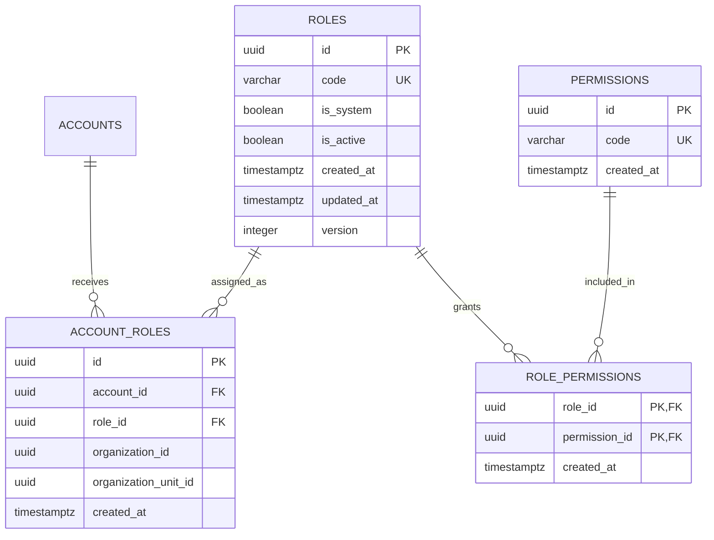

# RBAC, permissões e escopos

## Estado atual

O `PROT-017` materializa somente a fundação relacional de RBAC. As tabelas
`roles`, `permissions`, `role_permissions` e `account_roles` existem, mas seus
catálogos permanecem vazios. O `PROT-018` será responsável pelo seed inicial e
os tickets `PROT-030` a `PROT-032` implementarão a autorização funcional e a
validação dos vínculos contextuais.

Nenhuma rota, repository ou middleware deve consultar essas tabelas antes de a
cadeia completa de autorização estar implementada. Em particular, código de
papel não substitui verificação de permissão e verificações fixas como
`role === 'ADMIN'` continuam proibidas.

## Diagrama relacional

As relações com organização e unidade ainda não aparecem no diagrama porque
essas tabelas serão criadas pelos tickets `PROT-019` e `PROT-020`.

## Dicionário e invariantes

### `roles`

- `code` é um identificador técnico único, em minúsculas, iniciado por letra e
  seguido apenas por letras, números ou `_`;
- `is_system` identifica papéis estruturais protegidos e `is_active` controla se
  suas permissões podem participar de uma decisão;
- um papel de sistema não pode ser inativo;
- `version` implementa concorrência otimista nas mutações suportadas;
- a aplicação gera `id` UUID v7 e fornece explicitamente as flags; o banco não
  infere identidade nem política de negócio.

### `permissions`

- `code` é único e segue exatamente `<recurso>.<ação>`, com um único ponto;
- recurso e ação têm entre 1 e 63 caracteres e aceitam apenas minúsculas,
  números, `_` e `-`;
- exemplos válidos: `victim.view` e `emergency_alert.resolve`;
- o catálogo é imutável pela aplicação: sua evolução ocorre pelo fluxo
  versionado de catálogo definido no `PROT-018`.

### `role_permissions`

- a chave primária composta `(role_id, permission_id)` impede concessões
  duplicadas;
- ambas as referências usam `ON DELETE RESTRICT`;
- relações são imutáveis: alterações são inclusões ou remoções explícitas, não
  atualizações da chave.

### `account_roles`

- cada linha atribui um papel a uma conta em exatamente um contexto;
- referências a conta e papel usam `ON DELETE RESTRICT`;
- atribuições são imutáveis e não recebem soft delete; a retirada do acesso
  remove a associação explicitamente;
- a unicidade usa `NULLS NOT DISTINCT` sobre conta, papel, organização e
  unidade. Assim, duas atribuições globais idênticas também são duplicidade.

## Semântica de escopo

| Contexto     | `organization_id` | `organization_unit_id` | Válido |
| ------------ | ----------------- | ---------------------- | ------ |
| Global       | `NULL`            | `NULL`                 | sim    |
| Organização  | UUID              | `NULL`                 | sim    |
| Unidade      | UUID              | UUID                   | sim    |
| Unidade órfã | `NULL`            | UUID                   | não    |

Ao avaliar uma unidade, a consulta considera atribuições globais, da
organização solicitada e da própria unidade. Ao avaliar somente uma
organização, considera atribuições globais e dessa organização. A consulta deve
sempre filtrar papéis inativos e retornar permissões distintas.

Até `organizations` e `organization_units` existirem, os dois identificadores
contextuais são UUIDs reservados sem chave estrangeira. O `PROT-019` e o
`PROT-020` devem adicionar as referências em migrations futuras, sem reescrever
a migration deste ticket. O runtime só poderá autorizar acesso após validar a
existência, a relação unidade-organização e o vínculo ativo da conta.

## Proteção de papéis de sistema

Mutações suportadas de papel exigem simultaneamente `id`, `version` esperada e
`is_system = false`. Inclusões e remoções em `role_permissions` devem resolver o
papel e rejeitar `is_system = true`. O banco ainda garante que um papel de
sistema permaneça ativo e impede a remoção de qualquer papel referenciado.

Não há trigger oculto: operações administrativas fora do contrato da aplicação
são responsabilidade do fluxo controlado de migration e manutenção. Essa
fronteira mantém o schema declarativo Drizzle/Atlas como fonte verificável.

## Índices e consulta

- `account_roles_context_lookup_idx` atende a busca por conta e contexto;
- `account_roles_role_id_idx` atende referências e remoções de papel;
- `role_permissions_permission_id_idx` atende o caminho inverso do catálogo;
- chaves primárias e unicidades criam os índices dos joins por papel, permissão
  e atribuição contextual.

A decisão funcional futura deverá considerar, no mínimo, conta, organização,
unidade, vínculo ativo, papel ativo, permissão e recurso. Hierarquia de papéis,
cache de decisão, segregação de funções, auditoria de alterações e acesso
excepcional permanecem fora deste ticket.

## Tickets responsáveis

- `PROT-018`: seed inicial e catálogo TypeScript;
- `PROT-019` e `PROT-020`: entidades contextuais e respectivas FKs;
- `PROT-021`: vínculos da conta;
- `PROT-030`: middleware de permissão;
- `PROT-031` e `PROT-032`: escopos organizacional e de unidade;
- `PROT-034`: acesso excepcional break glass.

Cada ticket de domínio deverá registrar cenários autorizado, não autenticado,
sem permissão, organização diferente, unidade diferente, vínculo inativo e
break glass quando permitido.
